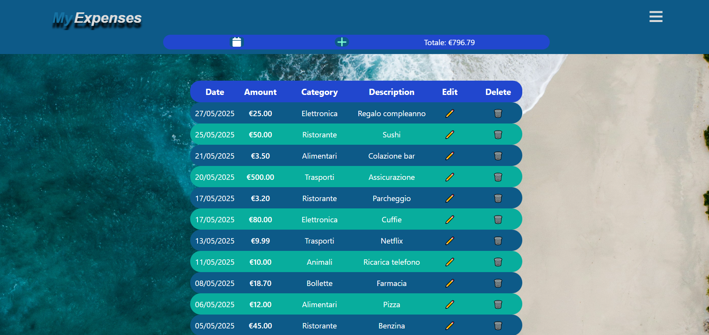
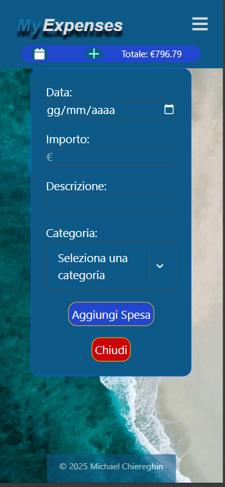
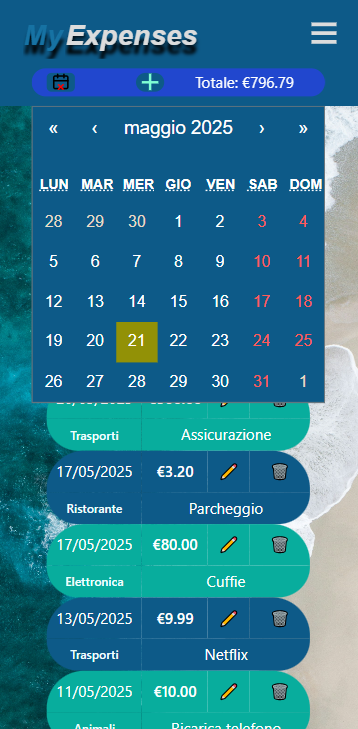
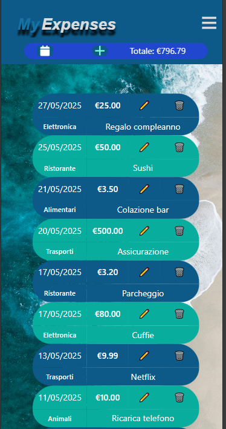

# 💸 MyExpenses - App per la gestione delle spese personali

**MyExpenses** è una web app full-stack che consente a più utenti di **registrare, leggere, modificare e cancellare spese** personali. Include **autenticazione**, **filtri per intervallo di date**, e un’interfaccia pulita e responsiva.

# 💸 MyExpenses - App per la gestione delle spese personali

...

---

## 📸 Screenshot

{.screenshot-img}
{.screenshot-img}
{.screenshot-img}
{.screenshot-img}

---

## 🚀 Tecnologie utilizzate

- **Frontend**: React (con Vite), Tailwind, Fetch API
- **Backend**: PHP 8, MySQL
- **Altro**:
  - Protezione CORS e header sicuri
  - Proxy per ambiente di sviluppo locale
  - Hosting su Altervista

---

## ⚙️ Funzionalità principali

- 🔐 Login e sessione utente con protezione accessi
- 👤 Supporto multi-utente
- 🧾 Sistema **CRUD completo** per la gestione delle spese:
  - ✅ **Crea** una nuova spesa
  - 📄 **Leggi** le spese per intervallo di date
  - ✏️ **Aggiorna** una spesa esistente
  - ❌ **Elimina** una spesa
- 📅 Filtro spese per range temporale (es. mese corrente, settimana, date personalizzate)
- 📱 Interfaccia responsive e moderna

---

## 🔐 Sicurezza

- Blocco degli accessi non autorizzati ai file interni
- Ambiente di sviluppo con **proxy locale** per evitare errori CORS

---

## 🎯 Obiettivi del progetto

Ho sviluppato MyExpenses per migliorare le seguenti skill:

- ✅ Integrazione frontend (React) con backend (PHP) reali
- ✅ Gestione della sessione utente e sicurezza nelle API
- ✅ Risoluzione di problemi CORS, cookie, e proxy in ambienti cross-domain
- ✅ Deploy su hosting condiviso (Altervista)
- ✅ Strutturazione di un'app **multiutente** con sessione persistente

---
